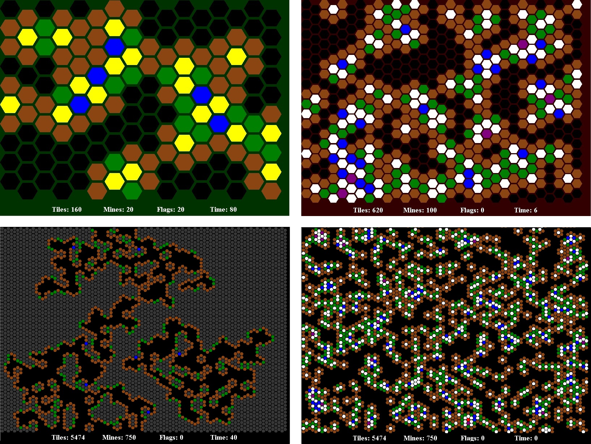

#Hexagonal Minesweeper

&nbsp;

Click [here](http://carsoncraig.me/jar/HexagonalMinesweeper.jar) to download an executable JAR.

&nbsp;

## Controls:

SPACE to Start

|Control|Purpose|
|:-:|:-:|
|F | Toggle Fullscreen Mode|
|E | Change Orientation of Hexagons|
|SPACE | Toggle Information Bar|
|UP | Decrease Number of Tiles|
|DOWN | Increase Number of Tiles|
|LEFT | Decrease Number of Mines|
|RIGHT | Increase Number of Mines|
|Q | Randomize Mines; Cover Mines |
|W | Cover Mines|
|A | Randomize Mines; Uncover Mines|
|S | Uncover Mines|
